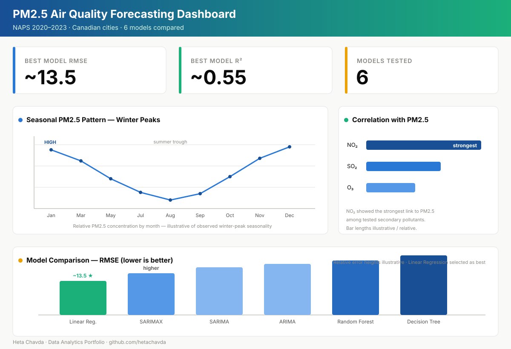

<div align="center">



# 🌫️ Forecasting Urban Air Quality
### Predicting PM2.5 Pollution Across Canadian Cities — Python & Time-Series Modeling


</div>

---

## 📌 Project at a Glance

| | |
|---|---|
| **🎯 Goal** | Forecast PM2.5 air-pollution levels to support public-health and smart-city decisions |
| **🧠 Approach** | Regression models + time-series forecasting (ARIMA family) |
| **📊 Data** | National Air Pollution Surveillance (NAPS), Canadian cities, 2020–2023 |
| **📈 Delivery** | Jupyter Notebook analysis + Power BI visualizations + project poster |

---

## 🧩 Business Problem

Poor air quality is a silent public-health cost — but pollution data on its own is just noise.

> 🌫️ **The question:** *Can we forecast PM2.5 concentrations reliably enough to warn the public and guide city planning?*

Turning raw sensor readings into a working forecast lets health authorities issue **early advisories**, and helps cities plan **infrastructure and traffic policy** around the days and seasons that matter most.

---

## 🗂️ Dataset

| Attribute | Detail |
|---|---|
| 📡 **Source** | National Air Pollution Surveillance (NAPS) network |
| 🗺️ **Scope** | Multiple Canadian cities |
| 🗓️ **Period** | 2020 – 2023 |
| 🎯 **Target** | PM2.5 concentration |
| 🧪 **Predictors** | NO₂, SO₂, O₃ (secondary pollutants) |
| ⚠️ **Known limitation** | Meteorological data (temperature, wind, humidity) not included |

---

## 🔬 Methodology

```
DATA PREP                    MODELING                       EVALUATION
──────────────────           ──────────────────────         ────────────────────
1. Load NAPS 2020–23         1. Linear Regression           1. RMSE & R² scoring
2. Clean & handle gaps       2. Decision Tree               2. Compare 6 models
3. Resample time series      3. Random Forest               3. Residual / error check
4. Correlate pollutants      4. ARIMA / SARIMA              4. Seasonal decomposition
5. Feature selection         5. SARIMAX (+ exog. NO₂/SO₂/O₃)   5. Best-model selection
```

---

## 📊 Air Quality Dashboard

<div align="center">



*PM2.5 seasonal trend, model comparison, and pollutant correlations, built from the project's Python and Power BI analysis.*

</div>

---

## 📈 Key Insights

- **Winter peaks:** PM2.5 concentrations run highest during winter months — a clear seasonal signal.
- **NO₂ is the strongest ally:** among secondary pollutants, **NO₂ showed the strongest correlation** with PM2.5.
- **Simple won:** plain **Linear Regression was the best performer** (RMSE ≈ 13.5, R² ≈ 0.55), outperforming tree ensembles on this data.
- **Exogenous boost:** **SARIMAX improved on SARIMA** once secondary pollutants were added as inputs.
- **Extreme events are hard:** model accuracy **dropped sharply during extreme pollution spikes**, and data gaps left seasonality only partially decomposed.

---

## 💼 Business Impact

| Stakeholder | Recommendation |
|---|---|
| 🏥 **Public Health** | Issue early PM2.5 advisories ahead of high-risk winter windows |
| 🏙️ **City Planning** | Target traffic and infrastructure policy at seasonal pollution peaks |
| 📡 **Data / Monitoring** | Add meteorological + denser sensor data to sharpen extreme-event forecasts |

---

## 🛠️ Technologies Used

| Category | Tools |
|---|---|
| **Language** | Python |
| **Analysis** | Pandas, NumPy |
| **Modeling** | scikit-learn, ARIMA / SARIMA / SARIMAX |
| **Visualization** | Matplotlib, Power BI |
| **Environment** | Jupyter Notebook |

---

## 📁 Repository Contents

```
PM2.5 Air Quality Capstone/
├── 📁 assets/
│   ├── 🎨 banner.svg    # Repository banner
│   └── 📊 dashboard.svg # Air quality dashboard
├── 📁 data/            # Raw & processed datasets
├── 📁 notebooks/       # Jupyter analysis notebooks
├── 📁 outputs/         # Results & visualizations
├── ⚙️ .gitattributes   # Git configuration
├── ⚙️ .gitignore       # Git ignore rules
└── 📝 README.md        # Project overview
```

---

<div align="center">

**Heta Chavda** — Data Analytics | Machine Learning | Business Intelligence

[](https://github.com/hetachavda)
[](https://linkedin.com/in/hetachavda)

⭐ *Found this useful? Give it a star!*

</div>
